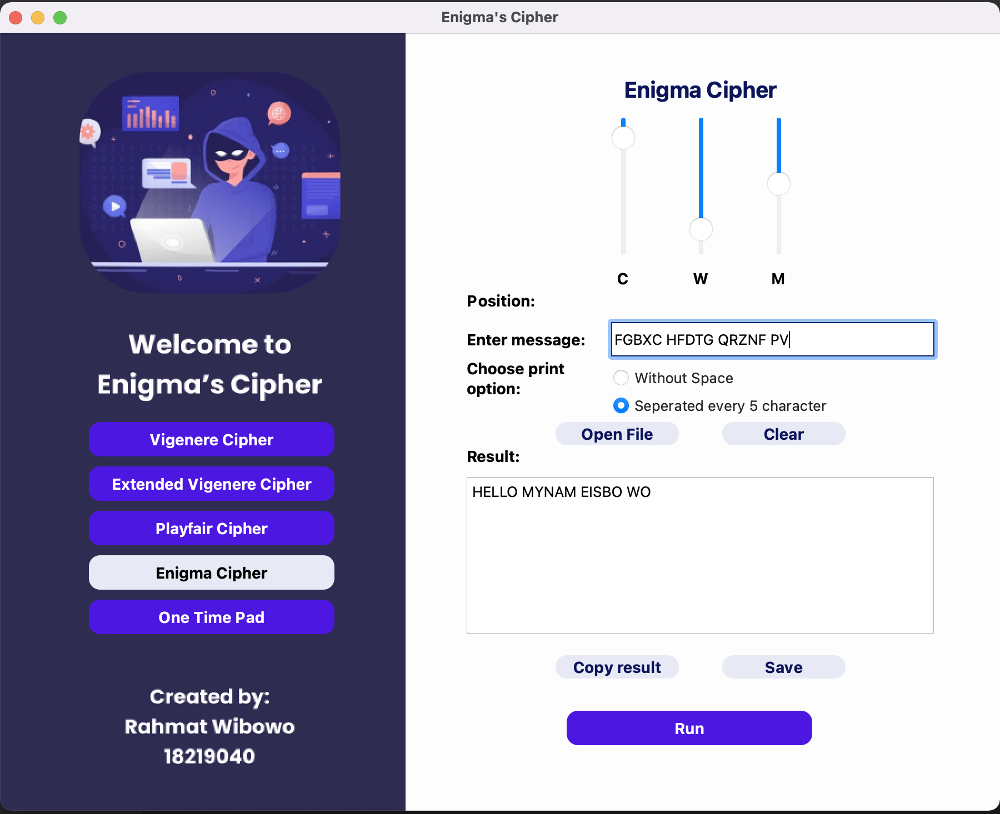
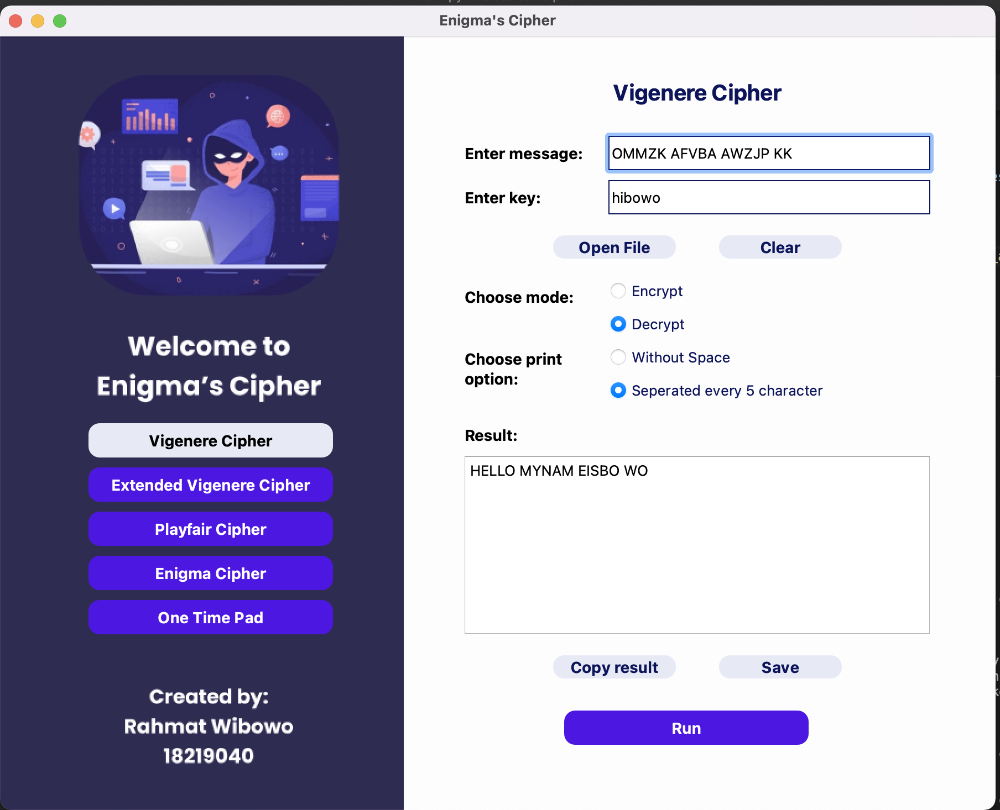

# Classical CIpher

## Program Feature
Doing encryption and decryption using file or text and download it using alghoritm below, anything except Extended Vigenere Cipher will be treated as text file with utf-8 encoding instead of bytes .
* Vigenere Ciphere (26 alphabet)
* Extended Vigenere Ciphere (256 ASCII)
* Playfair Ciphere (26 alphabet)
* Enigma Ciphere (26 alphabet)

## UI Interface
Enigma Cipher

Other Cipher

## Requirements
* PyQt5 
* Python 3.8

## Pre-installation
#### mac os: 
* brew install pyqt@5
#### ubuntu or other debian based:
* pip3 install pyqt5  
* sudo apt-get install python3-pyqt5  
* sudo apt-get install pyqt5-dev-tools
* sudo apt-get install qttools5-dev-tools

### How to Run
1. Go to directory ./src from root directory
2. pip install -r requirements.txt
3. python main.py or python3 main.py or py main.py

## If you are working with windows you can also try my virtualize app
1. Go to directory ./src from root directory
2. open enigma.exe

## Note : PyQt5 is not supported for arm64 based processor
### Author
* Rahmat Wibowo / 18219040